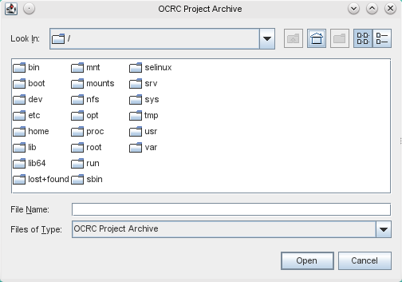

% Postcorrection Tool (PoCoTo) Manual
% Florian Fink\
    Centrum für Informations- und Sprachverarbeitung (CIS)\
    Ludwig-Maximilians-Universität München
% 2015-08-25\
    \vspace{1cm}{%
\includegraphics[width=0.2\textwidth]{img/by-nc-sa.eu.png}}\
<http://creativecommons.org/licenses/by-nc-sa/4.0/>

\newcommand{\pocoto}{\texttt{PoCoTo}}

\newpage

# Introduction
The Postcorrection Tool \pocoto{} is an interactive application for
the manual postcorrection of OCRed (historical) documents. You can use
it to examine the results of the optical character recognition in
context with the source images and improve the overall quality of the
recognition by correcting common errors in the document.

It offers various features that help the user to identify and correct
detection errors of the OCR engine. The application can automatically
propose correction candidates for *misspelled* words, recognize common error
patterns and correct multiple words over all pages of your documents
at once.

The main focus of the tool lies in the correction of historical
documents and it contains a set of features that help you correct
historical spelling variants without the need for additional,
historical dictionaries.

This manual tries to cover the  different aspects of the tool. It
covers both the basic usage of the tool and also more advanced
features. In order to ease the use of the tool, this manual tries to
set some basic conventions that have been proven to work with this
tool. Whenever possible the user should stick to the conventions used
in this manual, since special cases are not covered here. If you find
anything missing from the manual or if you discover any errors in the
application don't hesitate to write a short email to
<finkf@cis.lmu.de>.


## Menu items
Whenever this manual states to open a specific menu item, it will show
you the names of the items in the order you have to activate (click).
Sometimes there are menu items that are not active and can
therefore not be clicked. This happens if the application cannot
execute the action in the current context. Most often this is the case
if you have not opened a project yet. If you cannot click a menu
item, make sure that you have successfully opened a project
beforehand. If you have already opened a project, but you still cannot
click on the menu item, try to activate the current project, by simply
clicking on the document in the main view area (see below).

Depending on the language settings of your system, the names of menu
items can be in a different language. Do not get confused about
this. It should always be possible to find the right menu items even
if your language differs from the default English settings.

For example in order to export a project as a single plain
text file (set in the chapter [Exporting and importing]), you have to
activate the following items in order: `File -> Export -> as plain
text`. This means, that you have to open the `File` menu, then
click on the `Export` sub menu and then finally click on the item `as
plain text`. If your system's default language is German, you
would have to activate the items `Datei`, `Export` and `als
Textdokument`. If you cannot click one of these items, you have not
opened a project yet and you cannot export anything in this
context. You would have to open or create a project as described in
[Creating new projects] and in [Opening existing projects].

## Selecting files and directories
On many occasions, you have to choose some files or directories. Just
find and select the files or directories in the file chooser
dialog. If you need to open a directory, you cannot select a file and
vice versa. If you open a file to write, make sure that you do not
accidentally overwrite any important files, because \pocoto{} will not
always warn you, before you overwrite existing files.



## Example data
Most of the examples and images shown in this manual are taken from a
\pocoto{} session working with the Latin version of Hobbes'
Leviathan (1668). All files are available under the following
[link](http://www.cis.lmu.de/ocrworkshop/data/books/books-ocr.zip). The
archive contains various OCR  files[^files] in different
languages[^languages]. You can use all of the files in the archive to
reproduce the  examples shown in this manual and to experiment on your
own.

[^files]: Both the binary image files and the OCR XML output files.
[^languages]: At the time of this writing there are files in German,
    Latin  and Ancient Greek available.

# Basic usage
\pocoto{} is developed in the Java programming language. In order to
run it you need to have the Java virtual machine installed on your
computer. You can freely download and install it on your system from
the [Oracle](http://www.oracle.com/de/java/overview/index.html)
home page.

This chapter covers the basic usage of the tool, starting with how to
download the application and start it up. The layout of your OCR
output files is discussed at length. Later on all basic movement and
editing commands are explained.

## Downloading
In order to use \pocoto{} you must download the
[binary distribution][pocoto-zip]
and extract its contents. Copy the resulting `ocrcorrection` folder to
a convenient place in some directory. This directory contains
a `bin` folder that contains the application's executable files, which
you have to execute in order to start the application.

If you are interested, you can also download the source code of the
application. It is freely available on
[Github](https://github.com/thorstenv/PoCoTo). \pocoto{} is developed
in Java using the [Netbeans IDE](https://netbeans.org/). In order to
compile the source code you should have a recent version of the
Netbeans IDE installed on your system. You can then import the source
code directly into Netbeans and run the program from within it. Or you
can even checkout the git repository using the built in version
control support of Netbeans.

[pocoto-zip]: http://www.cis.lmu.de/ocrworkshop/data/pocoto/downloads/ocrcorrection.zip

## Running the program
After you have downloaded and extracted the \pocoto{} archive, you
have to execute the appropriate file to start \pocoto{}. Open the
`bin` directory of the `ocrcorrection` directory you just extracted
and double click on the appropriate executable file.

There are several files in the `bin` directory. Which file you have to
use depends on the operating system of your computer. If you are using
Linux, you have to double click the file called `ocrcorrection`. On a
Microsoft OS you have to either select `ocrcorrection.exe` or
`ocrcorrection64.exe`. Just try which one of the files starts
\pocoto{}.

\begin{figure}
\centering{\includegraphics{img/pocotosplash.png}}
\caption{\pocoto's splash screen}
\end{figure}

\pocoto{} will show its splash screen and load the application. The
splash screen should disappear after a short while and you should now
see \pocoto's main window.

\newpage

## Main window
\begin{figure}
\centering{\includegraphics{img/pocotomainwindow_marked.png}}
\caption{\pocoto's main window and its 5
areas}\label{fig:mainviewareas}
\end{figure}

\pocoto's main window is composed of 5 main areas:

1. The menu and toolbar area is at the upper border.
   It contains the menu items and the main navigation in the currently
   open document.
2. The main view area on the upper right side of the windows
   always contains the main view of the document.
3. The complete image view on the lower right side shows the page
   context of the currently active token.
4. The error area on the lower left side of the window contains an
   overview of token errors.
5. The token action area on the upper left side of the window contains
   buttons for merging and splitting of tokens as well as
   for the concordance view.

You can use your mouse to increase, decrease, show and hide the
different areas. You can drag and drop the areas to different
positions and rearrange them freely. \pocoto{} will remember your
settings and will restore them whenever you restart the
application. The manual always refers to  the standard layout of
\pocoto{}.

The menu and toolbar area (1) offers access to all settings and
actions of the application. The toolbar contains buttons to turn the
pages in the document, undo or redo your last actions or to zoom in or
out. The menu gives you access to all possible actions and enables you
to set various configuration parameters.

The most important areas are the main view and the complete image view
areas (2 and 3). The main view area (2) shows the text of single
tokens and their corresponding snippet in the source image. The
complete image view (3) marks the selected token and shows it in
its page context. Those two views may seem redundant at first, but
if the main view shows the concordance of some recurring error
patterns on different pages, the complete image view helps to keep
track of the larger context of a selected token. It can also help
you to decipher barely visible text parts, since a larger context can
often improve the readability. Both areas together are referred to as
the *main page area* or *main area* in the rest of this document.

\begin{figure}
\centering{\includegraphics{img/pocotoviews1.png}}
\caption{Example of the main view area and the coresponding complete
image view area. The selected token `Homines` in the main view area is
shown in its page context in the complete image view area.}
\end{figure}

The token action area (5) gives you easy access to the concordance
view and enables you to quickly merge and split tokens. More important
is the error area (4). It consists of two different error listings in
two different tabs. The second one lists common error patterns and
*suspicious* words^[
    The identification of these words both depends on the OCR engine
    and the output format you use.
]. If you used a profiler service to obtain a language profile for your
OCRed document (see
in the chapter [Profiler]), it will also show you common historical
spelling variations encountered in all the words over the whole
document.

\begin{figure}
\centering{\includegraphics{img/pocotoviews2.png}}\label{fig:view2}
\caption{Example of the error window showing common \emph{suspicious}
words and their frequencies over the whole document. The other
(left) tab would show you common error patterns and their frequencies.}
\end{figure}

\pocoto{} uses the information of the input document to identify
suspicious words. The errors shown are those words, that the OCR
engine marked as suspicious. If you encounter a lot of words that are
legal entries of the language's dictionary, make sure that the
language settings of your OCR engine match the language of the input
images for the OCR. In the example given in Figure \ref{fig:view2} an
English language setting was used for an input document in Latin. This
explains why legal Latin words like *etiam* or *Homine* are identified
as errors. In the end this does not matter much -- you can ignore
those false errors or even mark them as correct words.

If you see a lot of false errors this may be a pointer that you should
check the language settings of your OCR engine. Depending on the
OCR engine you use, it could improve the performance of the
recognition if you change the language settings accordingly. This is,
of course, only possible if your OCR engine contains a dictionary of
wordforms of that language.

## Input layout and input file formats
Before we can proceed to the creation of new projects and the basic
usage of the tool, we need to explain the input formats that \pocoto{}
understands and the required directory layout of the input files.

### Input files and formats
At this point, \pocoto{} supports three different XML file formats for
the input text and three different image formats for the source images
of the scanned document pages.

#### Supported XML file formats
\pocoto{} supports both the
[Abbyy XML](http://www.abbyy-developers.eu/en:tech:features:xml#abbyy_xml_export_overview)
and the
[hOCR](https://docs.google.com/document/d/1QQnIQtvdAC_8n92-LhwPcjtAUFwBlzE8EWnKAxlgVf0/preview?pli=1)
file formats. hOCR is the output format you get from
OCRopus and Tesseract. Additionally it supports its own internal XML file
format called OCRCXML^[
This format is sometimes also referred to as *DocXML*.
]. It is loosely based on the Abbyy XML format.

There are some caveats, though. Make sure that the Abbyy XML files are
*character* based as opposed to word or token based. This is
important, since \pocoto{} will exit with an error if you try to open
a word based Abbyy XML file. On the other hand, \pocoto{} supports
token based hOCR files. Since \pocoto{} uses the geometrical
information pertaining to the tokens and characters to create
the token snippets
of the source images, a character based XML file^[
    This means the Abbyy XML format, since \pocoto{} does not
    support character based hOCR formats yet.
] will generate more accurate character based snippets, even after
merging and splitting operations on the words.

The OCRCXML format is used by \pocoto{} internally. You can easily
export and import this file format. Notice that it is a truly
internal format and is not supported by external tools.

We will show you some examples of the supported input file formats on
the next pages^[
    They are all somewhat strangely formatted, though. Don't let this
    bother you.
].

\newpage

~~~{.xml}
<!-- snippet of the supported hOCR XML format... -->
<span class='ocr_line' id='line_1_1'
      title="bbox 303 120 1890 194;baseline 0.005 -25">
 <span class='ocrx_word' id='word_1_1'
       title='bbox 303 142 334 175; x_wconf 71'
       lang='eng'><strong>2</strong></span>
 <span class='ocrx_word' id='word_1_2'
       title='bbox 923 126 996 171; x_wconf 72'
       lang='eng' dir='ltr'>De</span>
 <span class='ocrx_word' id='word_1_3'
       title='bbox 1030 121 1243 172; x_wconf 73'
       lang='eng' dir='ltr'><strong><em>Homim.</em></strong></span>
 <span class='ocrx_word' id='word_1_4'
       title='bbox 1694 120 1821 194; x_wconf 79'
       lang='eng' dir='ltr'>Cap.</span>
 <span class='ocrx_word' id='word_1_5'
       title='bbox 1849 139 1890 177; x_wconf 85'
       lang='eng' dir='ltr'>I.</span>
</span>
<!-- ... -->
~~~

\newpage

~~~{.xml}
<!-- snippet of the supported Abbyy XML format... -->
<par align="Justified" startIndent="182">
 <line baseline="172" l="303" t="120" r="1890" b="194">
   <formatting lang="EnglishUnitedStates">
    <charParams l="303" t="142" r="334" b="175"
                charConfidence="24">2</charParams>
    <charParams l="335" t="126" r="922" b="175">    </charParams>
    <charParams l="923" t="126" r="969" b="171"
                suspicious="1" charConfidence="13">D</charParams>
    <charParams l="973" t="137" r="996" b="171"
                charConfidence="42">e</charParams>
    <charParams l="997" t="125" r="1029" b="171">    </charParams>
    <charParams l="1030" t="125" r="1082" b="171"
                suspicious="1" charConfidence="27">H</charParams>
    <charParams l="1079" t="138" r="1102" b="172"
                suspicious="1" charConfidence="18">e</charParams>
    <charParams l="1104" t="139" r="1149" b="170"
                suspicious="1" charConfidence="22">m</charParams>
    <charParams l="1152" t="121" r="1170" b="171"
                suspicious="1" charConfidence="100">i</charParams>
    <charParams l="1172" t="138" r="1202" b="171"
                charConfidence="21">n</charParams>
    <charParams l="1205" t="137" r="1231" b="171"
                charConfidence="34">e</charParams>
    <charParams l="1232" t="159" r="1243" b="172"
                charConfidence="25">.</charParams>
    <charParams l="1244" t="120" r="1693" b="172">    </charParams>
    <charParams l="1694" t="120" r="1738" b="172"
                charConfidence="88">C</charParams>
    <charParams l="1744" t="140" r="1770" b="173"
                charConfidence="33">a</charParams>
    <charParams l="1774" t="140" r="1805" b="194"
                charConfidence="50">p</charParams>
    <charParams l="1811" t="161" r="1821" b="171"
                charConfidence="73">.</charParams>
    <charParams l="1822" t="139" r="1848" b="174">    </charParams>
    <charParams l="1849" t="139" r="1870" b="174" suspicious="1"
                charConfidence="44">i</charParams>
    <charParams l="1878" t="164" r="1890" b="177"
                charConfidence="73">.</charParams>
  </formatting>
 </line>
</par>
<!-- ... -->
~~~

\newpage

#### Supported image file formats
\pocoto{} supports the most commonly encountered image file formats
including PNG, JPEG and TIF formats. These are the formats supported
by most OCR engines. You have to
use the same image file formats for \pocoto{} that you used as input for the
OCR engine. If you want to use different images as input for the OCR
engine and \pocoto{}^[
    For example if you want \pocoto{} to display the original colored
    images, but your OCR engine needs binary (black and white) images
    to process.
], make sure that the image files you use for \pocoto{} have the same
size (in pixels) as the images that you have used as input for the OCR
engine. Otherwise the word snippets that \pocoto{} displays will be
not aligned properly on the pages.

### Directory layout structure
In order to create a new project from your OCR resource files^[
    This means both the OCR input images and the OCR output XML or hOCR files.
] you need to organize them in a very specific way. If you plan to use
\pocoto{} on your OCRed files, it could be easier to consider the
naming restriction imposed by \pocoto{} before you do the actual
recognition of your files, otherwise you would have to change the naming
of existing files in a way that they match the imposed restrictions of
\pocoto{}.

We recommend that you stick to the following conventions for your
\pocoto{} projects (see the chapter [Projects] for more information
about \pocoto{} projects):

#### Project directories
Each project should live in its own project directory. All the project
files that \pocoto{} creates should be put into this directory. This
directory should be the base path of your project, as it will be
described in chapter [Creating new projects] later.

#### XML and image directories
Put the XML output files of the OCR engine into one directory in
the project folder and put the corresponding image files in another
directory. You can use the same directory for
both images and XML files if you prefer, but we do not recommend this
technique.

We call the image directory `img` and the corresponding XML directory
`xml`. You can use whatever convention you like. If we have different
image types and XML files from different OCR engines of *the same*
document we try to give the different directories obvious names like
`jpg-bin`, `tif-color`, `abbyy-xml` or `tess-hocr`. The corresponding
project names would then be `<project-name>-abbyy` and
`<project-name>-tess`. This has the advantage that we need to store the
image files only once. The different \pocoto{} projects refer to the
same images in one folder, but to different XML output files in
different folders.

#### File names
*The names of the images and XML files must correspond to each other.*
Make sure that
their names -- save for their file extension -- are *exactly* the
same. \pocoto{} uses the filenames to map between the XML and image
files. If the names do not correspond, \pocoto{} cannot find the
respective images for the OCR pages. If \pocoto{} gives you an error
saying *image could not be found* this most likely means that there
is a problem in the mapping between image and XML files. Check the
names of your files and make sure that they correspond to each other if you
encounter such an error.

For example, if you have to image files `img/page-01.jpg` and
`img/page-02.jpg` in the image directory of you project, the
corresponding XML files should be named `xml/page-01.xml` and
`xml/page-02.xml`.

#### Sorting order of the file names
The names of the XML files (and therefore the names of the image files
-- see above) should be named in a way that their *lexicographical,
ascending* sorting order conforms to the page numbering of the
document. The lexicographical smallest name should correspond to the
first page of the document and so on. That is why you should use the
page number in the document as a prefix in the file name. Make sure
that you use leading zeros to avoid incorrect ordering.

\begin{figure}
\centering{\includegraphics{img/directorylayout1.png}}\label{fig:dirlayout}
\caption{Naming conventions of the files. This is an example for the
names of XML and image files in two different directories. Notice that
only the file names must match -- not their file extensions. The order
of the files given in this example corresponds to the later page
ordering in the application.}
\end{figure}

For example the names of the pages of a document could be
`0001-book.xml`, `0002-book.xml`, \dots, `0020-book.xml`, \dots,
`0100-book.xml`, \dots. It is wrong^[
    At least it would destroy the page ordering.
] to name them `1-book.xml`, `2-book.xml`, \dots, `100-book.xml`,
since this naming convention would give a wrong ordering:
`1-book.xml`, `10-book.xml`, \dots, `11-book.xml`, `20-book.xml`,
\dots.

## Projects
\pocoto{} manages documents as separate projects. A project contains a
collection of different XML and image files that form the pages of a
logical document such as a book or an article. Each project consists
of three special project files storing the
internal project information. They also contain your saved
corrections and the language information. For each project \pocoto{}
creates three distinct file names in your chosen project directory:
`<project-name>.h2.db`, `<project-name>.ocrproject` and
`<project-name>.trace.db`. The `.ocrproject` file contains the
configuration data of the project; the two other files are database
files used by the project to store the various information of the
document. You should *never* edit one of the database files, since
this will most likely end in a corrupted file that cannot be used by
\pocoto{} anymore. If you are absolutely sure that you know what you
are doing, you could edit the `.ocrproject` file manually^[
    And maybe not even then.
].

If you you accidentally delete one of those three project files, you
will most probably lose all the information about the project and all the
work stored in your project. If you create a new project with the same
name as an already existing project in the same directory, \pocoto{}
will ask you if you want to overwrite the existing project. If you
answer yes and create the new project, your old project will be
overwritten and ceases to exist.

### Creating new projects
In order to start with the postcorrection of your OCRed files you have
to create a new project from your existing OCR files. Make sure that
you have read and understood the chapter
[Input layout and input file formats] and that you have organized your
input files accordingly.

Click to `File -> New Project` to open the *New project wizard*. This
will open a wizard window that helps you to configure your new
project.

The wizard consists of three separate steps. After you have finished
one step, click on the button *Next* to go to the next step. If you
cannot click on the *Next* button, you have not completely filled in
all the required information. It is also possible to change the
settings of previous steps. Just click on the *Back* button to go one
step back. You can see your current position on the navigation area on
the left side of the window. If you want to abort the creation of the
new project, you can always click *Cancel* to close the wizard and
abort the creation of the new project.

#### The first step: project name and path
In the first step of the wizard you have to configure a project name
and a project path. Enter your project name into the text input field
labeled *Project Name*. Following the conventions about the directory
layout as explained in section [Directory layout structure], choose
now the the project directory that contains the directory of your OCR
files as *Project Path*. Just click on the *Browse* button to open the
file chooser dialog and select your project directory.

The dialog will open. Navigate to the project directory on your
computer and select it. You can only select directories. It is not
possible to accidentally select a file. If you have set all required
parameters you can go to the next step by clicking onto the *Next*
button. This will bring you to the second configuration step, so you
can simply select the XML directory directly if you have followed the
suggested directory layout.

\begin{figure}
\centering{\includegraphics{img/newprojectwizardstep1.png}}
\caption{First step of the \emph{New Project wizard}. All required
configuration parameters have been set -- so you can proceed to the
next step.}
\end{figure}


#### The second step: OCR directory
In the second step you have to configure the directory of the OCR
files. This means the *output files* of your OCR engine,
that will be used as *input files* for \pocoto{}.

First of all you should choose the OCR directory. This is the
directory where all the XML or hOCR files are stored.
Again just click on the
*Browse* button and select the directory accordingly. Note that the
file chooser dialog opens in the project directory that you configured
as project path in the previous step.

After you have selected the OCR directory, select the input
file format respectively input type. You can either select *Abbyy XML* or
*hOCR*.

Optionally you can select the input encoding of the OCR files in the
directory. In some circumstances you might choose another input
encoding depending on the encoding of the OCR files. But normally the
default option *UTF-8* should suffice. Click *Next* afterwards to go
to the third and final step of the wizard.

\begin{figure}
\centering{\includegraphics{img/newprojectwizardstep2.png}}
\caption{Second step of the \emph{New Project wizard}}
\end{figure}

#### The third step: image directory
In the third step you have to select the image directory of your
project. If you followed the standard layout you just have to select
the `img` directory in the project directory. Note that the file
chooser dialog starts again in the previously configured project
directory.

After you have selected the correct image directory just click the
*Finish* button to create the new project. \pocoto{} will import the
XML/hOCR and image files, setup the configuration and database files and
start to display the first page of your document. Depending on the
size of your project (number of pages in your document) this can take
some time.

\begin{figure}
\centering{\includegraphics{img/newprojectwizardstep3.png}}
\caption{Third and last step of the \emph{New Project wizard}}
\end{figure}

### Opening existing projects
Whenever you start \pocoto{}, it will start without an opened project. In
order to open an existing project you can either click on `File ->
Recent Project` and select a recent project of yours or you can
click to `File -> Open Project` to navigate to a \pocoto{} project on
your local directory tree.

In the latter case the file chooser dialog that opens up will just
show you directories and `.ocrproject` files. Navigate to the
respective project folder and select the `.ocrproject` file.

After you have selected an existing project, \pocoto{} will load it
and you can keep on correcting your project. All correction you
already made to the project will be there^[
    If you have saved them before leaving \pocoto{}.
].

## Basic navigation
In \pocoto{} you can navigate through the pages of your documents by
using the page navigation buttons in the toolbar area (1) (see
figure \ref{fig:mainviewareas} on page
\pageref{fig:mainviewareas}). You can go forward or backwards using
the appropriate buttons, by one, five or ten pages at a time. You can
also jump to the first or last page of the document. If you change to
another page, both the main view area (2) and the complete image view
area (3) will change accordingly. Note that if the navigation buttons
are deactivated, you can click onto the main view area to activate
them again.

You can navigate within the current page using either the scroll wheel
of your mouse (while hovering over the main view area (2)) or using the
scrollbars^[
    Remember that you can always increase or decrease the frame size
    of the different areas using your mouse.
]. You can also both increase and decrease the zooming factor of the
image and the text size using the zooming buttons in the menu bar.

The main image view shows the reading order of the token of the
currently selected page. For each token the token snippet on the image
and the corresponding characters of the text recognition are shown. If
you click on any token snippet in the main view area (2), the complete
image area (3) is updated and the token in the context of the page is
shown. The text of the selected token is marked red in the main image
view (2).

\begin{figure}
\centering{\includegraphics{img/pocototoolbar1.png}}
\caption{The buttons of the tool bar menu from left to right: The save
button, the undo and redo buttons, the page navigation buttons and the
zooming buttons.}
\end{figure}

## Undoing and redoing changes
You can always undo your last recent changes by either clicking on the
*undo* button in the tool bar menu or by selecting `Edit -> Undo` from
the main menu. If you want to undo your last undo or if you want to
repeat your last action, you can use the *redo* button or select `edit
-> redo` to do so.

## Saving your changes
In order to save your changes, you can either click the *save* button
in the tool bar menu or select `File -> Save` from the main menu. If
you save your changes the undo / redo information of \pocoto{} is
discarded. You cannot undo or redo anything after you have saved your
recent changes.

## Closing \pocoto{}
You can close the application by selecting `File -> Exit` or clicking
on the `x` in the upper right corner of \pocoto{}'s window. If you
close \pocoto{} it will ask you if you want it to save your last
changes before exiting.

# Concordance view
Beside the normal page oriented view, \pocoto{} has another
facility to display the words of your document. This so called
concordance view is able to list a concordance of tokens over all
pages in your project's document.

\pocoto{} can easily create a concordance view for you. This
concordance view shows a list of similar tokens and their line context
over the whole document. It can be used to examine error patterns and
spelling variants or to see all equal words in the document. In the
concordance view, the main area does not show the tokens of a page but
a list of tokens over all pages in their line context. If you click on
any token in the concordance view the complete image view will show
the token in its page context as usual.

The concordance view is loaded as a new tab in the main
area. You can use the tabs to switch between many different
active concordance views simultaneously. In order to close a
concordance view, you can click on the small `x` on the right side of
the tab^[
    Although the main page view is also a tab, you cannot close it.
]. This view also offers various buttons that can help you to batch-correct common errors at once (see the chapter
[Batch error correction] for more information).

In order to create a concordance view of a specific token, select
this token in the main view area (2). If the selected token has
another occurrence somewhere in the document, you will see that the
button *Show concordance* in the token actions area (5) is activated. If you
click on this button, \pocoto{} will calculate the concordance view of
your selected token and display the concordance view in a new tab in
the main area.

It is important to understand that the concordance view is able to
simultaneously show tokens from different pages in the document.
The complete image
view shows a selected token in the context of the page where this token is
found. So if you click on different tokens in the concordance view,
different pages will be shown.

Of course it is possible to create another concordance view from an
existing one. Just click on one token, and if there is more than one
occurrence of the token in the whole document you can click again on
the *Show concordance* button in the token action area (5) to open yet
another concordance view in a new tab.

\begin{figure}
\centering{\includegraphics{img/concordanceview1.png}}
\caption{This image shows a concordance view of the word
\emph{tempora}. The currently selected token is \emph{funt}. On the
left side in the token actions area you can see that it is possible to
create another concordance view of the 187 (presumably inaccurate)
occurrences of the token \emph{funt}.}
\end{figure}

The other way to open a concordance view is to use the errors area
(4) of \pocoto{}. If you click on any of the listed words or spelling
patterns, \pocoto{} will create the corresponding concordance view
of the misspelled token or of all tokens that presumably have a
common spelling variation pattern. Note that the concordance view you get
by clicking on a token in the main view area and by clicking
a token in the OCR error tab in the error area are exactly the
same. The OCR error tab just gives you an easier access to the most
common errors in the document.

The main reason to use the concordance view is to correct a set of
errors in the whole project at once. The next chapter
[Error correction] explains in detail how you can use the concordance
view to correct such an error series.

# Error correction
\pocoto{}'s main focus lies on the correction of OCR errors. It offers
different methods that help the user to detect and correct various
kinds of errors in the document. First of all the basic error
correction approach is explained. More advanced error correction
techniques will be explained later in this chapter.

## Basic error correction
To correct a word, in the main view area (2) double click on the text
or the snippet of the token you want to correct. This will open a
context menu that you can use to correct the word.

\begin{figure}
\centering{\includegraphics{img/pocotoerrorcorrection1.png}}
\caption{Correcting one word}
\end{figure}

You will have the following options in the context menu:

* You can mark the word as correct. This will remove this token from the
  Error overview. It will not be displayed in the error correction
  overview any more. \pocoto{} will mark this token with a green
  underline.
* You can delete the token. This will remove the token form the
  document.
* You can merge the token with its right neighbor. This will combine
  the two tokens to one. This option is only available if the selected
  token has a right neighbor on its line (see the next chapter
  [Splitting and merging of tokens]).
* You can type in the correction of the token. Just start to type the
  correct word on the keyboard and the text of the token will be
  updated accordingly. Hit the `enter` key or click on the button with
  the return key symbol at the right of the text input field when you
  are done. If you have entered any whitespace, the token will be
  split at the whitespace positions (set the next section
  [Splitting and merging of tokens]).
* If you already have profiled the document, as it is explained in
  the chapter [Profiler], you will see an additional list of
  correction suggestions. You can select either of them to correct the
  word accordingly.
<!-- ⏎ -->

## Splitting and merging of tokens
Sometimes the recognition of your OCR engine does not properly
recognize token bounds. Either it recognizes two or more tokens, where
there should be only one or it recognizes one token that consists of two or
more real tokens. In the first case you have to split a token into
several. In the second case you have to merge two or more tokens together
to one.

\pocoto{} supports both operations even on multiple tokens. Note that
both merging and splitting of tokens only works for tokens on *the
same line*. It is not possible to merge tokens over line or page
boundaries and it is not possible to merge words that have been split
over a line and are not recognized as a connected token by the OCR
engine.

In the previous section you already saw how you can merge and split
tokens. If you double click on a token, you can select *Merge with
next word* to merge the current token with the next one. If you want
to split a token, just insert a literal whitespace character when you
update the text of the token. In this case \pocoto{} calculates the
split positions automatically. That way you can split a token into as
many parts as you like.

It is also possible to merge more than one token. Just draw a
rectangle over all tokens you want to select^[
    Click once around a token and then draw the mouse pointer
    to the right or left. You will see a blue rectangle, that you can
    use to select multiple tokens.
]. All tokens of your selection are colored and you can now either use
the button *Merge selected tokens* in the token action area (5) to
merge these tokens, or you can delete all of them, by clicking the
*Delete selected tokens* button.

\begin{figure}
\centering{\includegraphics{img/pocotorectangleselection.png}}
\caption{Selecting multiple tokens}
\end{figure}

\newpage

## Batch error correction
\pocoto{} also offers *batch error correction*. This helps you to
correct not only single errors, but a
set of similar error patterns at once. Needless to say that if you
correct a whole set of tokens at once you should be extra cautious
before you apply the corrections to all of them. Always check that all
of the selected tokens need the same kind of correction.

The batch error correction works in close cooperation with the
concordance view (see the chapter [Concordance view]). If you want to
batch correct some tokens, first open a concordance view. In this view
you will notice some buttons. First of all there are the main
operation buttons on the top of the view. Then there are check boxes
on each token of the concordance. You can either activate the check
boxes on the tokens to select specific tokens or you can use the
*Select all* button to select all tokens in the concordance view.

To change the text of the selected tokens, you can click on the
*Change candidate* button to set the new, updated text. A small window
will open where you can enter your correction. To apply the change,
click *Ok* in the window and finally click the *Correct*
button. \pocoto{} will now update all selected tokens. Do not forget
to save your changes afterward (see section [Saving your changes]).

If you created the concordance view using the profiler error window
(see chapter [Concordance view] or if you have successfully run the
profiler service over your project (see the chapter [Profiler]), you will
notice default correction candidates. If you like those you can
directly use these correction candidates without manually entering the
correction as described in the previous paragraph.

\begin{figure}
\centering{\includegraphics{img/pocotobatchcorrection1.png}}
\caption{Batch correcting multiple tokens: Click on \emph{Select all}
to select all tokens in the concordance view.}
\end{figure}


\newpage

# Profiler Service

As mentioned on various occasions in this manual, \pocoto{} can
utilize a specialized profiler service for your OCRed pages. This
service calculates language dependent statistical hypotheses for OCR
errors and historical spellings based on your OCRed document. Using
this information, \pocoto{} will present you a list of misspelled
words together with correction candidates to choose from, as well as
an overview of error patterns by which wrongly recognized words can be
transformed into valid lexical words (see
Fig. \ref{fig:errorpattern}).

\begin{figure}
\centering{\includegraphics{img/pocoto-error-patterns.png}}
\caption{Error patterns for a (Latin) document}
\label{fig:errorpattern}
\end{figure}

In order to get such a profile there must exist a profiler service
for your language, and you must either have access to a
profiler web service that provides such service over the web
or (experts only) have installed language resources
together with the profiler software on your system.

For more information about the profiler web service (and how you can install it locally)
see the [profiler manual](http://www.cis.lmu.de/ocrworkshop/data/manuals/profiler-manual.pdf).

## Profiling using the profiler web service
The easiest method to get a language profile for your OCRed document
is to use an existing profiler web service. The profiler web service offers the language
and OCR result specific profiles over the Internet and makes it possible for you to get
the results without installing any additional tools.

### Configuring the profiler web service URL
In order to use the profiler web service you have to configure a valid
service URL. This URL is the connection point to a running
instance of the profiler web service. If you want more information
about the profiler web service, take a look into the
[profiler manual](http://www.cis.lmu.de/ocrworkshop/data/manuals/profiler-manual.pdf)
on how to configure and deploy the web service. CIS offers an open
profiler web service for various languages. If you want to use
it, you have to use the following URL for the configuration:
`marmolata:9080:cis.lmu.de/axis2/services/ProfilerWebService`. You can use
any valid URL for a running instance of the web service.

To configure the URL of the web service, click to `Tools -> Options`
and open the *Profiler* tab in the window that opens up. Enter a
profiler web service URL into the input field and click *Ok*.

### Ordering a document profile
In order to profile your project you have to order a language dependent
document profile from the web service. Click to `Profiler -> Order document
profile`. \pocoto{} will connect to the web service and retrieve a
list of available languages on the server. Select the language
you want to use and click *Ok*. A warning will appear that informs
you that the profiling will take a long time to finish. Click again on
*Ok* in order to start the profiling.

As the notification states, the profiling will take a while. It must
upload your project onto the server, run the profiler with the
appropriate language settings on your files and download and import
the result back into your project. After the profiling has finished
you will get a notification informing you that the profiling has
finished.

## Experts only: Using a local profiler
If you have installed the profiler command line tool on your system
and have appropriate language resources available, you can locally
profile your exported project on the command line and re-import it into
\pocoto{}. If you want to do this, you should have a good
understanding on the usage of command line tools and have read the
[profiler manual](http://www.cis.lmu.de/ocrworkshop/data/manuals/profiler-manual.pdf)
on how to install the profiler and generate a language profile for your OCRed document
locally. In the remainder of this section it is assumed that you have
installed the profiler and that you have access to appropriate
language resources^[
    including the `.ini` file for the language configuration,
    the language dictionaries, a historical pattern file and the
    initial pattern frequencies and weights.
]. Make also sure that you have read and understood the profiler
manual on how to use the profiler command line tool. It is no problem
to skip this section, since you can still use the profiler web service
from \pocoto{} as described in the previous section
[Profiling using the profiler web service].

### Exporting the project
In order to profile your project, you have to *export* it as a OCRCXML
file. This format is used to communicate between \pocoto{} and the
profiler. Click to `File -> Export as DocXML`, define a place and a
filename to export to and then export your project as an DocXML
formatted file. This exported DocXML file will be the input file for
the profiler command line tool in the next step.

### Calculating a language profile for your OCRed document
After exporting your project, open a command line and call the
profiler with the appropriate command line options. Use the following
command to profile the project file you just exported in the previous
step^[
    Make sure that you adjust the paths of the files according to your
    requirements.
]:

```{.bash}
$ profiler --config path/to/language/profile/lang.ini \
  --sourceFile pocoto_export.ocrcxml \
  --sourceFormat DocXML \
  --out_xml profile.xml \
  --out_doc pocoto_import.ocrcxml
```
The first command line option for the profiler is the language
configuration file of the language you want to use on your
file. You have to specify the path to your exported project file with
the `--sourceFile` switch and set the `--sourceFormat` to
`DocXml`. The profiler will generate two output files that you will
need to import into \pocoto{} to make the profile of your document available
for correction purposes.

The general project file with the appropriate correction candidates
for misspelled words must be specified with the `--out_doc` switch. In
order to get an overview over the encountered OCR correction
patterns, you need to specify the path of the profile with the `--out_xml`
command line switch. Remember the names of those two output files for
the next step.

### Importing the language profile for your OCRed document
As the final step, you have to import the two output files of the profiler
into \pocoto{}.

Just click on `File -> Import from DocXML`. You will be asked
to specify two files in order. Select the output file you specified
with the `--out_doc` switch in the previous step first. Afterwards specify
the profile file you generated with the `--out_xml` switch.

\pocoto{} should start to import the profile. Be patient,
this can take some time. After the import is finished you have a
language profile for your OCRed document ready as if you would have ordered one from a
profiler web service.

## The language profile for your OCRed document
After you have have equipped yourself with a language profile for your OCRed
document using any of the two previously described methods, \pocoto{} now has some additional
features available that will help you to correct misspelled words. Be
aware though, that the profile is not always correct. The
corrections are suggestions and often there is more than one feasible
correction candidate. Whenever you want to apply corrections in batch mode
for a whole pattern series, be sure that you do not accidentally alter valid words.

### OCR Profiler error patterns
In the error area (3) of \pocoto{} there is a tab that shows you a
list of common error patterns and the frequency of their
occurrence. These error patterns show common OCR errors --
like confusing the letter *e* with the letter *c* -- in the form
*correct letter(s) -> incorrect letter(s)*, as *e -> c* in our example.

Historical spelling patterns like the older German Thür for Tür
are left alone even if Thür doesn't appear in the modern lexicon, because it can be traced
back to the modern form by the historical pattern th -> t which is part of the
provided language resources from which the error profile gets calculated.

You can click onto any of those error patterns to create a concordance view
of all the words that supposedly feature such a pattern and
that can be corrected to valid dictionary entries using the respective
pattern rule (see Fig. \ref{patterncorr} for the pattern *ct -> d*).
Just proceed to batch correct those errors as described
in the section [Batch error correction].

### Correction candidates
The profiling also generates a list of correction candidates for any
suspicious words in your project. Whenever you try to correct a token
as described in the section [Basic error correction], you will get an
additional list of correction candidates in the sub-menu. You can
always choose one of these correction candidates by clicking on
it. The chosen token will be corrected and the text of the token
will be updated to the suggested correction candidate.

\begin{figure}
\centering{\includegraphics{img/pocoto-error-patterns-correction-suggestions.png}}
\caption{Correction suggestions for correcting single words}
\end{figure}

The correction candidates of the language and document dependent error
profile also play an important role in the concordance view (see chapter
[Concordance view]) and the batch correction of misspelled words (see
section [Batch error correction]).

After you have profiled your project, any concordance view, no matter
if it comes from a profiler error pattern or the concordance of
similar words, now has a button where you can select correction
candidates automatically. It is also possible to batch correct all
misspelled words using their default correction suggestion without the
need to manually insert the correction.

\begin{figure}
\centering{\includegraphics{img/pocoto-error-patterns-concordance.png}}
\caption{Correction suggestions in the concordance view}
\label{patterncorr}
\end{figure}

This does not only apply to similar words, but also to words with
similar error patterns. Consider the German *long s*. If your OCR
engine does not know this character, it will very likely recognize
every occurrence of this character as an *f*. If you would profile
such a document, the profiler would give most likely a pattern rule `f
-> s`. If you click on this pattern you will get a list of all
occurrences where the profiler thinks that such an error has
occurred^[
    That means all the words that could be mapped to a valid (modern)
    dictionary entry by the application of the `f -> s` pattern
    rule to the word.
]. You can now simply select all words where the application of this
pattern would actually correct the word and apply the correction to
all selected words. In this example all selected instances of *ift*
would be corrected to *ist*, whereas all selected instances of *fo*
would be corrected to *so* and so on. You do not have to manually
correct these words -- \pocoto{} is able to apply the correction
automatically.

## Unicode Normalization Format and the profiler

If you intend to use the PoCoTo with the profiler you need to make
sure that the normalization format of the input files for PoCoTo match
those used to construct the profiler. PoCoTo, the profiler and the
ProfilerWebService currently lack any mechanism to detect different
normalization formats or convert between them automatically.

# Exporting and importing
\pocoto{} has some facilities to import and export files. As you have
seen in the chapter [Using a local profiler], you can import
and export your projects^[
    Including any language profiles for your OCRed documents
] using \pocoto{}'s internal OCRCXML file format. Although this format
is based on the formatting of Abbyy XML files, there are no tools
available for using these files directly. You can only use this
importing and exporting facility to share your \pocoto{} project files.

If you want to export your project in this format, click on `File ->
Export -> as DocXML` and select a file name. Later you can import this
project back into \pocoto{}. Click to `File -> Open Project` and
select an OCRCXML export file to import into \pocoto{}.

You can also export your project as plain text files. Click to `file
-> Export -> as page separated plain text`, or `File -> Export -> plain
text file`. The former exports all pages of your project^[
    Including your corrections, of course
] as a single text file. The latter exports each page as a separate
file into a directory that you can specify.

At the time of this writing there is no possibility to export your
project back into the original format of your OCR files. Therefore  is
not yet possible to apply the corrections you did in \pocoto{} to your
OCR files. Alas, there are no tools to convert \pocoto{}'s internal
file format into the supported OCR file formats as well.

We know that this is a big drawback. But this export functionality is
under active development and will be finished as part of the current
development process of \pocoto{}. When this feature has been implemented,
you will be able to update \pocoto{} and then have the ability to export
your project files
back into your original OCR output files, without the need to update
your projects.

# Updating the application
\pocoto{} has the capability to automatically update itself. This
means that any stable development of \pocoto{} can be automatically
distributed to all active users of \pocoto{}.

If you start up \pocoto{}, and if there are any update available, you
will see a notification about available updates in the lower left
corner of the window. You can click to *Update* to apply those updates
to the application. Depending on the update, \pocoto{} may need to be
restarted afterwards.

You have to enable this update mechanism manually. Click on `Tools ->
Plugins` to open the plugins configuration window. In this window
open the `settings` tab and click to the *Add* button. A window will
open where you can enter a name associated with the update URL and
the update URL itself.
You can choose any name you like for the update name. For the update
URL, use one of the two following update URLs of \pocoto{}.

\pocoto{} is currently updated with two different URLs:

1. `http://www.cis.lmu.de/ocrworkshop/pocoto/updates/stable`
2. `http://www.cis.lmu.de/ocrworkshop/pocoto/updates/testing`

The first URL provides all stable updates of \pocoto{}. If you want to
get the latest features which are not yet tested very well, you could also
set the update URL to the second testing URL. If you do so you should
manage some backups of your projects, since these testing features
could break your project files.

# \pocoto{}'s private files
## Cache
\pocoto{} uses a private cache that stores the different configuration
parameters in order speed up the application's startup. Sometimes this
cache can tamper with your private settings after you have either
downloaded a new version of \pocoto{} or after you have updated it
(see the previous chapter [Updating the application]).

If you suspect a problem with the cache you can try to delete
\pocoto{}'s private directory `.ocrcorrection` in your user's home
directory. Be aware that \pocoto{}'s log file resides in this private
directory as well (see the next section [Log files]). So make sure to
copy it before you delete the directory.

## Log files
\pocoto{} writes warnings, errors, and general debugging information to
a log file. If you encounter any errors in \pocoto{} you should check
this log file first. This file can also help developers to find
and fix potential bugs. In the case that you find a bug
you can send an email with the description of the bug and
your log file to a developer of \pocoto{} (<finkf@cis.lmu.de>).

\pocoto{}'s log file can be found in \pocoto{}'s private directory
(see the previous section [Cache]) in your basic user directory
`.ocrcorrection/dev/pocoto.log`.

# References

---
nocite: |
  @vobl2014pocoto
...
