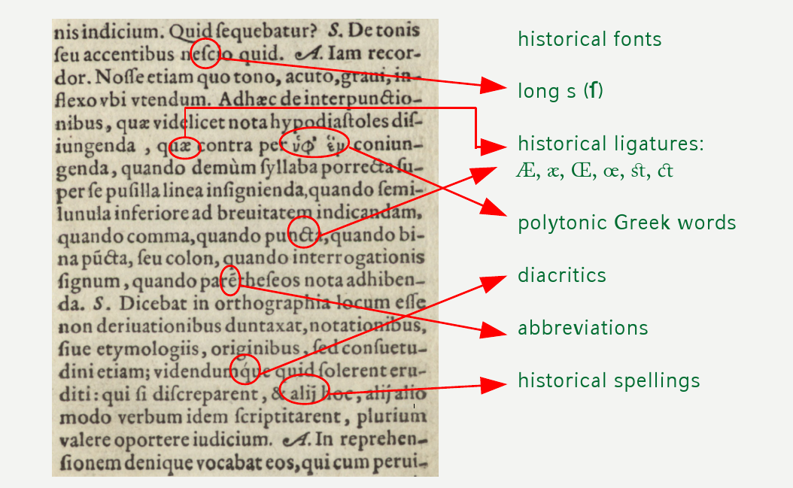
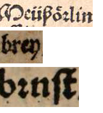
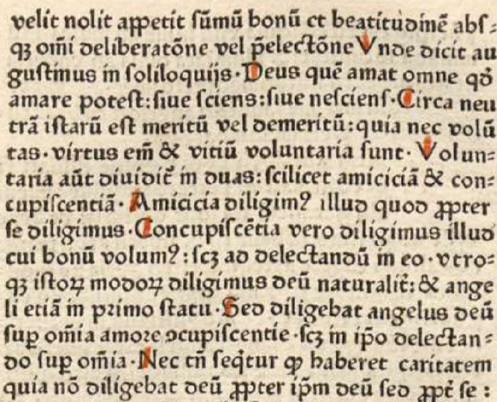
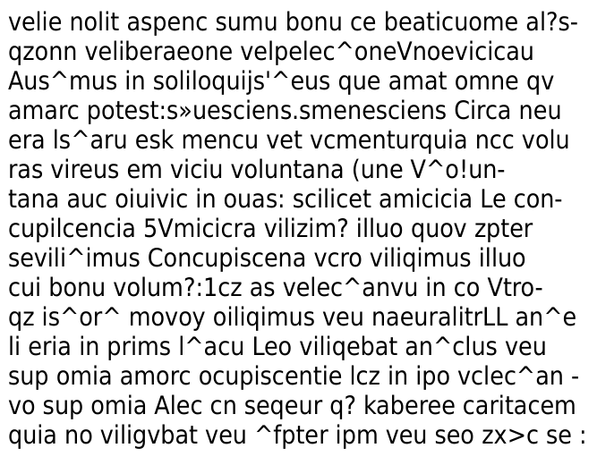
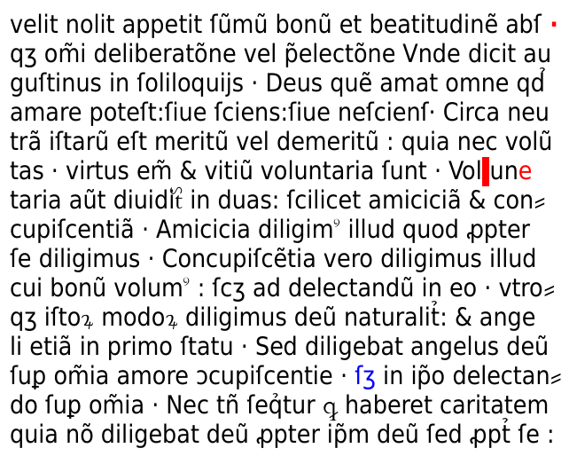
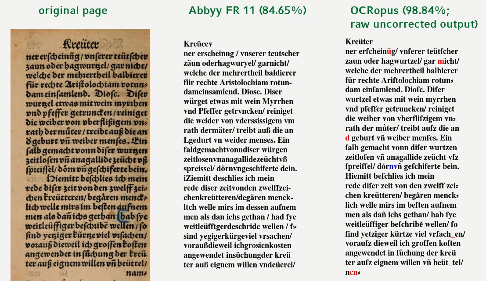

% Module 1  
 Challenges & Methods
% Uwe Springmann
% 2015-09-14

## Goals

1. make electronic representations of
(all) documents universally available

    + make scanned images of document
      pages accessible over the internet

2. make scanned images searchable

    + OCR (with errors)

3. make one representation as machine-actionable electronic text

    + annotation, postcorrection

* can be seen as large-scale program or as individual project focused on
    specific documents

* this workshop: mostly concerned with steps 2 and 3 above

## Transmission of texts
\

# Introduction to OCR

## OCR: definition & history
* **Optical Character Recognition (OCR): automated conversion of images
    of printed pages to machine-actionable text**

* early applications: reading device for blind people (Fournier d’Albe:
    Optophone, 1913; Kurzweil: Reading Machine, 1974)

* today important business: paperless office, automatic workflow

* leading proprietary products: *Finereader* (ABBYY), *Omnipage* (Nuance), *ReadIris* (Canon)

* good open source software available since 2005: *[Tesseract][tesseract]* (Ray Smith, HP Labs, now Google), *[OCRopus][ocropus]* (Tom Breuel, DFKI Kaiserslautern, now
    Google)

[tesseract]: <https://github.com/tesseract-ocr/tesseract>
[ocropus]: https://github.com/tmbdev/ocropy

## OCR workflow

* the complete OCR workflow consists of several steps (step 3 is optional):

    #. image acquisition
    #. preprocessing
    #. (ground truth production, model training)
    #. recognition
    #. evaluation
    #. postprocessing: annotation, error correction, tagging, ...

## OCR research

* OCR belongs to pattern recognition, artificial intelligence, computer vision
    (hot topics)

* product related proprietary research mostly done in commercial companies (scanning hardware manufacturers, Google)

* general opinion: OCR is a solved problem! (for 20th century printings and beyond: >99% correctly recognized characters)

* not at all true for earlier printings: Gothic scripts, non-Latin alphabets, unusual glyphs, complex layout, book degradation from usage and ageing

* much academic research on postprocessing of commercial engine OCR output (spelling correction, annotation, search in noisy data)

## Renewed interest in OCR

* massive digitization (=scanning!) of historical printings (newspapers, books): [Google Books][googlebooks] (scan 130 mill. books until 2020), libraries ([Bavarian State Library][BSB] has > 1 mill. books scanned, [HathiTrust][hathi]: > 10 mill. books)

* long term goal of funding institutions: make all scanned books available in text form (must be automatic process = OCR)

* [EU IMPACT project][impact] (2008-2012)

* CIS: Prof. Schulz (postcorrection, since 2004)

* [Open Greek and Latin project][OGL], Greg Crane (U Leipzig)

* [Early Modern OCR Project (eMOP)][emop], Laura Mandell (Texas A&M
    University)

* Dan Klein, Taylor Berg-Kirkpatrick (University of California, Berkeley): *[Ocular][ocular]*

[googlebooks]: https://books.google.com/
[BSB]: <http://www.digitale-sammlungen.de>
[hathi]: <https://www.hathitrust.org/>
[impact]: <http://www.digitisation.eu>
[OGL]: <http://www.dh.uni-leipzig.de/wo/projects/open-greek-and-latin-project/>
[emop]: <http://emop.tamu.edu>
[ocular]: <http://nlp.cs.berkeley.edu/projects/ocular.shtml>

# Digression: OCR errors, OCR quality measures

## Important concepts to know

* we talk of OCR errors as misrecognized elements (characters or words)

* *error rate*: errors / all elements

* *accuracy*: correctly recognized elements / all elements = 1 - error rate

* the rest of this section is more mathematical and serves as background reading

## OCR errors
OCR errors can be classified as elementary edit operations:

* misspelled characters: *substitutions, s*
* spurious symbols: *insertions, i*
* missing text: *deletions, d*

for OCR sometimes additional elementary operations:
* symbol splits, e.g. m -> in
* symbol merges, e.g. cl -> d

Example:

* exerciſed $\to$ exercifed (*substitution* of long s by f)
* in $\to$ m (*deletion* of i followed by substitution n $\to$ m)
* having $\to$ hav ing (*insertion* of blank, resulting in word split)

## Levenshtein distance, error rate, accuracy

**Levenshtein distance (LD): the minimum number of edit operations to
transform an input string into an output string**

Example: *ernest* $to$ *nester*: LD = 4

* delete *er* at beginning and insert *er* at end
* not: substitute each letter separately (6 operations!)
* -> now we have an unambiguous definition of *s+i+d*
* the single errors *s,i,d* may not be unique (ab -> ba: s=2 or d=1,i=1)!

We have *errors (s,i,d)* and *correct output tokens (c)* (4 oberservables) with
$n_\mathrm{GT} = c+s+d, n_\mathrm{OCR} = c+s+i$

**Error rate: ratio of errors to "all" tokens** (n), $e = \frac{s+i+d}{n} = \frac{s+i+d}{c+s+i+d}$

(often $n = n_\mathrm{GT}$ or $n = n_\mathrm{OCR}$ - watch out for used definitions!)

error rate can be measured at character (CER) or word (WER) level

**Accuracy: ratio of correct tokens to "all" tokens**, $A = \frac{c}{c+s+i+d} = 1 - e$

## Definition of precision and recall

think Cinderella, picking out lentils with the help of birds:

| The good ones go into the pot,
| The bad ones go into your crop

* four cases:
    + True positives, $T_\mathrm{p}$: good ones picked out
    + False positives, $F_\mathrm{p}$: bad ones falsely picked out or good ones damaged
    + True negatives, $T_\mathrm{n}$: bad ones correctly eaten
    + False negatives, $F_\mathrm{n}$: good ones missed, falsely eaten or damaged
* summing up:
    + number of items picked out: $N_\mathrm{pot} = T_\mathrm{p} + F_\mathrm{p} = N_\mathrm{OCR}$
    + number of good items: $N_\mathrm{good} = T_\mathrm{p} + F_\mathrm{n} = N_\mathrm{GT}$

* **Precision: proportion of good items in retrieved set, $p = T_\mathrm{p}/N_\mathrm{pot}$ (Reinheitsgrad)**

* **Recall: proportion of good items retrieved, $r = T_\mathrm{p}/N_\mathrm{good}$ (Ausbeute)**

## Precision and recall in OCR

* we have:
    + $T_\mathrm{p} = c$
    + $T_\mathrm{n} = 0$ (we want to recognize all items, none are originally bad)
    + $N_\mathrm{GT} = c + s + d$
    + $N_\mathrm{OCR} = c + s + i$

* therefore:
    + $p = \frac{c}{c + s + i}$
    + $r = \frac{c}{c + s + d}$

* now we can identify $F_\mathrm{p}$ and $F_\mathrm{n}$ in terms of OCR errors:
    + $F_\mathrm{p} = s + i$
    + $F_\mathrm{n} = s + d$ (not missed items, but damaged and destroyed items)

* make one measure out of two:
    + F-measure, harmonic mean of p and r
    + $F = \frac{2pr}{p + r}$

# Historical OCR

## OCR for historical printings?

In historical documents we often find:

* lots of different printing types
* high variability in letter shapes
* special glyphs, script and alphabet mixtures
* high variability in spelling, morphology, and syntax → variable context
* right justification in manual typesetting leads to:
    - abbreviations (vnd, vñ)
    - insertions of consonants (von, vonn)
    - narrow inter-word spacing

Therefore:

* results are often unsatisfactory for broken scripts (Gothic, Fraktur) and earlier texts [@Piotrowski2012; @StrangeEtAl2014]

## The challenge (I): historical typographies
\

clockwise: printing year (author)\
1564 (Valla), 1487 (Foresti),
1735 (Leyser), 1557 (Bodenstein)

## The challenge (II): special glyphs

Pontanus: [Progymnasmata Latinitatis][progymnasmata] (1589)

[progymnasmata]: http://daten.digitale-sammlungen.de/bsb00037616/image_65

\

## The challenge (III): historical fonts, historical spellings
(Anke Lüdeling, HU Berlin)

\colA{6cm}
\

u? n? tt? un? v?

\colB{6cm}
\

meüßoͤrlin (modern: Mäusöhrlein)?
brey (modern: Brei)? brust (brnst)?

\colEnd

## The challenge (IV): incunabula

[Beauvais: Speculum naturale][specnat] (not after 1476); ABBYY FR11 Fraktur 68% acc.

[specnat]: http://daten.digitale-sammlungen.de/bsb00035779/image_59

\colA{5cm}
\
\colB{5cm}
\
\colEnd

An incunabulum printing has special abbreviation
signs, e.g. ꝑ ꝓ p̈  Ꝙ ꝙ͛ ſcʒ.

[[@rydberg2009digitizing]][rydberg] (our emphasis):
*"Because of the prevalence of these glyphs, **incunabula cannot be processed using OCR software**. Commercial OCR programs produce almost no recognizable character strings, let alone searchable text. ... **Other methods** must be explored."*

[rydberg]: http://www.digitalhumanities.org/dhq/vol/3/1/000027/000027.html\#p7

## Other (OCR) methods: OCR with recurrent neural networks

* recurrent neural network (RNN) with long short-term memory (LSTM) as

* invented by [@hochreiter1997long], first applied to OCR by [@breuel2013high]

* input layer: pixel values of vertically sliced text lines (500–1000 frames)

* memory layer: 100 hidden memory blocks

* output layer: character representations (glyphs)

* needs training (either on artifically generated images from text or ground
truth corresponding to printed text)

* learns by adjusting weights between connections of layers

* does not need a language model

* can be trained on a lot of scripts and languages, even on mixed cases

## Trained models for incunabula
Trained OCRopus model (this passage: 99% acc.)\
\

\colA{5cm}
\
\colB{5cm}
\
\colEnd

* trained on 13 pages, tested on additional 4 pages
* 98% average character accuracy (raw, uncorrected output)
* no language model employed

## Schwabacher font: old and new methods

[Adam von Bodenstein (1557)][bodenstein]; ABBYY FR 11 Fraktur + hist. lexicon

[bodenstein]: http://reader.digitale-sammlungen.de/de/fs1/object/display/bsb10727106_00102.html

\

## Mixed typefaces: old and new methods

[Augustinus Leyser (1735)][leyser]

\colA{6cm}

\

\colB{5cm}

* mixed typefaces: Fraktur for German, Antiqua for Latin.

* trained on 40 pages, tested on 8 pages.

* mean acc. 97%

    (ABBYY 77%, Tesseract 82%)

\colEnd

[leyser]: http://diglib.hab.de/drucke/rd-255-5b/start.htm?image=00452

## OCR over the centuries

residual error on 24 herbal texts from 1487 to 1870: individually trained models, RIDGES Corpus [@springmann2015dhd]

\includegraphics[width=0.9\linewidth]{images/centuries.pdf}

## Conclusions

* for modern material (even including 19th century Fraktur) the pretrained models of ABBYY, Tesseract and OCRopus give very good results (above 98% character accuracy) [@breuel2013high]

* for older material, missing language models (Latin) and the above-mentioned challenges severely limit the performance of pre-trained models to about 85% (incunables even less); even perfect lexica will raise accuracies to just about 90% [@springmann2014]

* trained OCRopus models will consistently give > 95% (up to 99%) accuracies depending only on the quality of the scans, not on printing date

## References {.allowframebreaks}
