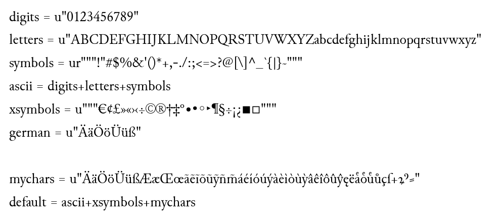

% Module 4  
How to transform incunabula: Theory
% Uwe Springmann
% 2015-09-14

## Why incunabula?

* oldest documents in modern printing (1450-1500)

* contain many abbreviations from manuscript era

* each printer (had to) cut his own types

* *reason 1: if we can do incunabula, we can do anything else that comes later*

* period of societal change: reformation, renaissance, age of discovery (America)

* printing was quickly embraced as a method for the dissemination of ideas

* *reason 2: incunabula are primary sources (often never reprinted) of a key period of modern society*

## Steps in model training

The special incunabula glyphs need to be explicitly taken into account:

* ground truth production
    + choose some (8-13) representative pages to transcribe
    + get an overview of the glyph repertoire
    + explicitly state your transcription guidelines
    + transcribe the chosen pages
    + set a few pages (10%) apart as test pages, the rest are your training pages
    
* training a model
    + segment the test and training pages into single lines
    + train for 10 to 100 epochs (1 epoch = total number of training lines)
    + stop when error no longes decreases (levels off and fluctuates)
    + test your models on test pages
    + choose model with least error on test pages
    + if accuracy is ok, recognize all preprocessed pages (total book)
    + if not, add a few more transcribed pages to your training and test pool and continue training
    
    
# Ground truth production

## How to choose training pages
* do not just choose the first n pages: title, table of contents, introduction will usually not be representative (special fonts, font sizes etc.)

* choose some non-contiguous pages from the body of the book

* try to catch the most frequent glyphs, fonts, sizes: what is not in the training pages cannot be learned and recognized

* things that you miss should be rare (e.g., occasional Greek characters or symbols)

## Investigating the glyph repertoire

* after transcription of a few pages new glyphs will show up less frequently

* but if new characters must later be added to the model, you will need to restart training from the beginning

* fortunately, we have the [Typenrepertorium der Wiegendrucke][tw] of 2000 different officinæ (printers' workshops) (Konrad Haebler, 1905-1924)

* the "impressum" at the end of the book names the printer and year:

\centering{\includegraphics[width=0.5\linewidth]{images/gdg-impressum.png}}

* so let's search for Mr. Conrad Dinckmut at Ulm!

[tw]: http://tw.staatsbibliothek-berlin.de/


## Investigating the glyph repertoire (cont'd)

A list of typesets used by [Dinckmut][dinckmut] (not complete):

\centering{\includegraphics[width=1.0\linewidth]{images/tw.png}}

[dinckmut]: http://tw.staatsbibliothek-berlin.de/queries/id.xql?id=of0322

## The glyph repertoire

These are the glyphs that have been used (plus some additional ones):

Type 2:109G  
\centering{\includegraphics[width=0.9\linewidth]{images/dinckmut-type2.png}}

Type 3:147G  
\centering{\includegraphics[width=0.4\linewidth]{images/dinckmut-type3.png}}


## Glyphs, representations, meanings

* single characters are easy

* ligatures: split them into single characters (be, ck etc.)

* special abbreviation symbols or vowels with diacritica (Dinckmut: 5 u!):
    + find a code point by looking at the  
    [Medieval Unicode Font Initiative (MUFI) character recommendation table v. 3.0][mufi-3.0]
    + e.g. ꝝ (rum, U+A75D); ꝰ (us, os, U+A770)
    + for unique abbreviations, you may choose to transcribe their meaning (rum instead of ꝝ)
    + but most are context dependent, so you must transcribe the surface form
        - ĩ: in, im; nõis: nominis; tñ: tamen; vñ: unde
        - ꝑ (U+A751): per, par
        
    + you might want to avoid private use area (PUA) recommendations, as they are font specific
        -  (que, U+E8BF); you may use something else (e.g. q;)
    
[mufi-3.0]: http://folk.uib.no/hnooh/mufi/specs/index.html


## Unicode normalization forms

* there are sometimes several possibilities for transcription:
    + e.g. á (U+00E1) or á (a followed by acute accent, U+0301) 
    + the first form is called "Unicode Normalization Form Composed (NFC)", the second "Unicode Normalization Form Decomposed (NFD)"
    + a printed glyph needs always to be transcribed by the same code point(s)
    + but in practice, transcription errors occur (especially by several transcribers)
    + some form of checking and normalization is needed
    
* recommendation: use the form that is most conveniently accessible from the keyboard and normalize later

* normalization to either NFC or NFD is available in software (Perl, Python, Java, [ICU][icu], uconv)

* example for conversion to NFC: 
    
    ```bash
    uconv -f utf8 -t utf8 -x nfc -o text-nfc.txt text-orig.txt
    ```

[icu]: http://site.icu-project.org/

## Transcription guidelines

* you probably do not want to transcribe purely typographical elements
    + straight (r) and round (ꝛ) r (complementary distribution,  
      but no semantic difference)
    + consonant and mixed ligatures (ff, fi etc.)

* but it does make sense to transcribe some meaningful features  
  no longer in use today
    + vowel ligatures æ, œ (hiatus vs. diphthong: poeta, pœna in Latin)
    + long s (ſ ): Wach-ſtube, Wachs-tube (guard room, wax tube)
    + diacritica in Latin to avoid homographs:
        - adverb/adjective (vocative): altè/alte
        - adverb/pronoun: quàm/quam
        - conjunction/preposition: cùm/cum
        - ablative/nominative: hastâ/hasta


## Transcription guidelines (cont'd)

* you can always normalize to other/modern spellings later with a script!

* you will (have to) transcribe some glyphs by non-Unicode characters
    + because there is no code point representing them
    + or for convenience reasons (use characters from the keyboard such as @, $, # not otherwise present in the text and replace them later with a script)

* state your transcription guidelines in written form and observe them
    + will make your own transcriptions consistent
    + bears the chance that you and others can exchange transcriptions and normalize them: more material for better  models

* example: [Guidelines of Deutsches Textarchiv][dta-guidelines] (in German)

[dta-guidelines]: http://www.deutschestextarchiv.de/doku/richtlinien


## Transcribing a set of pages

\colA{4cm}


\colB{6cm}

* can be done in a browser (you may need a special font with many glyphs, e.g. [Junicode][junicode])

* line synopsis html file can be produced by OCRopus from line segmented images
    
* save file as complete web page and extract ground truth

* now you have line images as \*.bin.png and corresponding ground truth as \*.gt.txt for training and test purposes
    
\colEnd

[junicode]: http://junicode.sourceforge.net/

# Model training

## Define your character set

Add the characters corresponding to special glyphs to the list of characters known to OCRopus (file `ocropy/lib/python/ocrolib/chars.py`):

\


## Starting the training

* training is started by
    ```bash
        ocropus-rtrain -o <modelname> <training-dir>/*/*.bin.png
    ```

* after a while, your console output looks like this:
```bash
23055 1.99 (497, 48) train/0004/01001f.bin.png
   TRU: u'vertreibt die \u017fchlangen die in den'
   ALN: u'vertreibt die \u017fchlangen die in den'
   OUT: u'vertreibt die \u017fchlan gen die in den'
23056 1.42 (508, 48) train/0002/010046.bin.png
   TRU: u'laxieren i\u017ft vnd purgieren / das dz'
   ALN: u'laxieren i\u017ft vnd purgieren / das dz'
   OUT: u'laxieren i\u017ft vnd purgieren / das dz'
23057 2.02 (514, 48) train/0001/01002e.bin.png
   TRU: u'che fraw wee mit ainem kind gat'
   ALN: u'che fraw wee mit ainem kind gat'
   OUT: u'che fra w wee mit ainem kind gat'
```

## Training output

* information on console:
    + lines seen, error estimate, (pixel width, height), file name
    + TRU: ground truth
    + ALN: aligned output
    + OUT: predicted output

* non-ASCII symbols are coded, e.g. `\u017f` (ſ )

* each 1000 steps a model gets written to disk: 
    ```bash
        <modelname>-<steps>.pyrnn.gz
    ```
    
## Graphical output

You can watch the network learn by starting training with option `-d <number>`, e.g.
```bash
    ocropus-rtrain -o <modelname> -d 1 <training-dir>/*/*.bin.png`
```
\


## Graphical output explained

from top to bottom:

* line image with ground truth written above (this is input)

* network output (upper: predicted; lower: aligned)
    + vertical axis represents characters (printer's type case!)
    + horizontal axis corresponds to position in image
    
* horizontally-resolved posterior probabilities for output characters
    + green: word spaces
    + blue: character with highest probability
    + yellow: "no character present"
    
* some uncertainty at position 300 (round r) and 480 (e)

* learning progress and prediction error over learning steps
    + grey: single line least square training error 
    + black: moving average least square training error
    + red: moving average edit distance of OUT
 
  
## Testing a model

* run a model on test data and generate OCR output:
    ```bash
        ocropus-rpred -m <modelname> test/*/*.bin.png
    ```
* then compare the OCR output (prediction) against ground truth:
    ```bash
        ocropus-errs test/*/*.gt.txt
    ```
* output looks like this (# errors, # characters, filename of text line):
    ```bash
     1	    36	test/0012/010014.gt.txt
     0	    30	test/0012/010015.gt.txt
     1	    37	test/0012/010016.gt.txt
     1	    35	test/0012/010017.gt.txt
     2	    31	test/0012/010018.gt.txt
     1	    30	test/0012/010019.gt.txt
     1	    31	test/0012/01001a.gt.txt
     0	    12	test/0012/01001b.gt.txt
errors         177
missing          0
total         4656
err          3.802 %
errnomiss    3.802 %
    ```
      
## Finding the best model

* after the neural net has seen the training lines several times (about 30-100), the recognition errors don't get better (they just fluctuate): stop further training

* the best model has the lowest recognition error on the set of test pages

* run each model on the test pages and write the result to a file:
    ```bash
        for i in *.pyrnn.gz; do
            echo "$i" >> modeltest
            ocropus-rpred -m "$i" test/*/*.bin.png
            ocropus-errs test/*/*.gt.txt 2>>modeltest
        done                
    ```
* "modeltest" contains for each model just the last 5 output lines of ocropus-errs

* if you are satisfied with the result, OCR the complete document

* otherwise, produce some more ground truth and restart model training

* the whole procedure is explained in more detail in the [Ocrocis tutorial][ocrocistut] at the [Ocrocis homepage][ocrocis] 

[ocrocistut]: http://cistern.cis.lmu.de/ocrocis/tutorial.pdf
[ocrocis]: http://cistern.cis.lmu.de/ocrocis/

