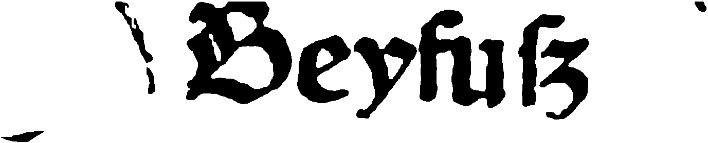

% Module 5  
  Converting incunabula: Practice
% Uwe Springmann
% 2015-09-14

## Practice session: Overview
Steps to do:

* download the data for this session from the [data][module-data] directory

* take the preprocessed pages of "Gart der Gesundheit" and do line segmentation

* build an html file and generate ground truth

* begin model training

* take an existing model, run it on test pages and evaluate the result

Some steps depend on a running OCRopus/Ocrocis installation, but *everybody can do the 
ground truth generation*. 

All Ocropus commands have help text, see e.g. `ocropus-gpageseg -h` for options.

* in reality, a philologist/historian/etc. would do ground truth annotation and give the result to his or her IT support person (except if you are a *digital humanist*)

[module-data]: http://www.cis.lmu.de/ocrworkshop/data/module-data

## Line segmentation

* these commands are somewhat compute intensive, so if your laptop is too weak or you haven`t installed OCRopus, skip to the next step

* your binarized images of *Gart der Gesundheit* are in the directory `/tif`

* apply Ocropus binarization (this is here not necessary, but is an alternative to ScanTailor binarization):
    ```bash
        ocropus-nlbin -n tif/* -o book
    ```
* apply Ocropus line segmentation:
    ```bash
        ocropus-gpageseg -n book/*.bin.png
    ```
* you could also segment the tif images directly:
    ```bash
        ocropus-gpageseg -n tif/*.tif
    ```
* generate an editable html file:
    ```bash
        ocropus-gtedit html -H 35 book/*/*.bin.png -o gt.html
    ```

## Generating ground truth
* start from the file `gt.html` (generated or provided, see `data` directory):
    ```bash
        firefox gt.html
    ```
* some lines have been incorrectly segmented, leave them alone (no text to enter)
* image lines without corresponding ground truth will not bet trained
* use the transcription guidelines: `richtlinien.pdf`
* entering special characters:
    + Linux: 
        - CTRL-SHIFT-U, release, then type hexcode
        - or type `gucharmap` into a terminal
    + Windows: type `charmap` into the command line
    + Mac: go to *Edit > Special Characters* 
    
* if you are done (one page?), save the file to the same directory where your `book/` is found (`gt-1.html`)


## Preparing training and test data
* extract the ground truth:
    ```bash
        ocropus-gtedit extract gt-1.html
    ```

* your `book/` directory now contains a ground truth file for each line you edited:

\colA{4cm}
```bash
book/
     0001/
          010001.bin.png
          010001.gt.txt
          010002.bin.png
          010002.gt.txt
          ...
     0002/
     ...
``` 
\colB{5cm}
 \
 \
`010001.bin.png`:
\

\colEnd

* copy 90% of your pages (`0001/` etc.) into a `train/` directory, 10% into a `test/` directory
* you may want to crop some line images to remove noise (see above)
 
## Training a model

* normalize your data (here: to NFC; do the same for data under `test`)
```bash
    for f in train/*/*.gt.txt; do 
        uconv -f utf8 -t utf8 -x nfc -o "${f/gt.txt/gtneu.txt}" "$f"
    done
    for f in train/*/*.gtneu.txt; do 
        mv "$f" "${f/gtneu.txt/gt.txt}"
    done
```
* start training with explicit character set:
    +  use the provided `chars.py` and place it under `ocropy/lib/python/ocrolib`; then:
    
    ```bash
        ocropus-rtrain -o gdgmodel -d 1 train/*/*.bin.png
    ```

* shortcut: let Ocropus find the set of characters from your annotations
```bash
    ocropus-rtrain -c train/*/*.gt.txt test/*/*.gt.txt \
        -o gdgmodel -d 1 train/*/*.bin.png
```
    + (due to NFKC normalization, you will lose the ſ )
    
## Evaluate a trained model

* copy the model `GdG-00023000.pyrnn.gz` and `test.tar.gz` to your computer
    + ground truth for training this model was kindly provided by the [RIDGES][ridges] 
    corpus at HU Berlin (Anke Lüdeling et alii)

* extract the test data and recognize the text:
```bash
    ocropus-rpred -n -m GdG-00023000.pyrnn.gz test/*/*.bin.png
```

* test for errors:
```bash
    ocropus-errs test/*/*.gt.txt
```

* look at the character confusions:
```bash
    ocropus-econf test/*/*.gt.txt
```

* experiment with the context parameter -C, e.g.
```bash
    ocropus-econf -C2 test/*/*.gt.txt
```

[ridges]: http://korpling.german.hu-berlin.de/ridges/index_en.html

## OCR a book

* download `book.tar.gz` and extract (or use your own data in `book/`)

* recognize a book
```bash
    ocropus-rpred -n -m GdG-00023000.pyrnn.gz book/*/*.bin.png
```

* extract the predicted text
```bash
    ocropus-hocr book/*.bin.png
    ocropus-gtedit text book/*/*.bin.png
```

* look at the files `book.html, correct.txt, reference.html`

* generate a line synopsis for further correction and view `Correction.html`
```bash
    ocropus-gtedit html -H30 book/*/*.bin.png
    firefox Correction.html
```
