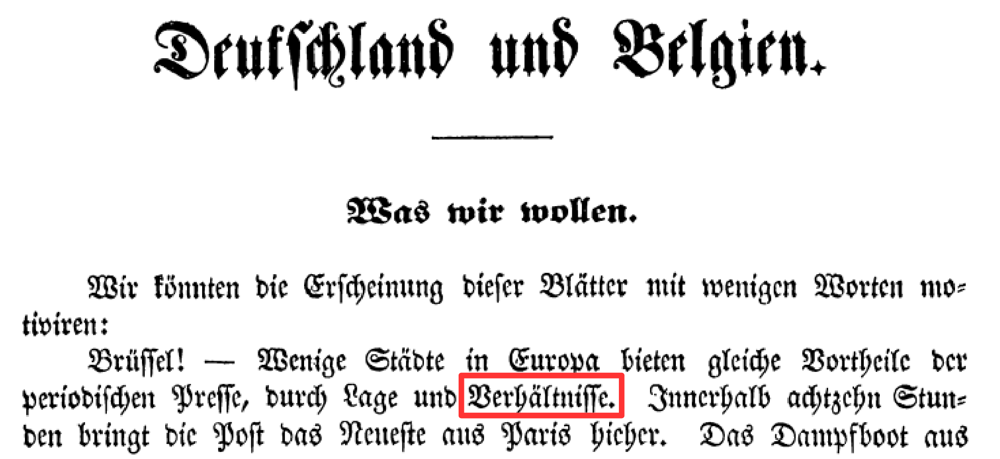
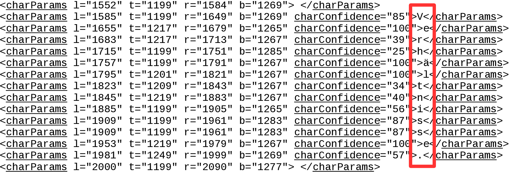
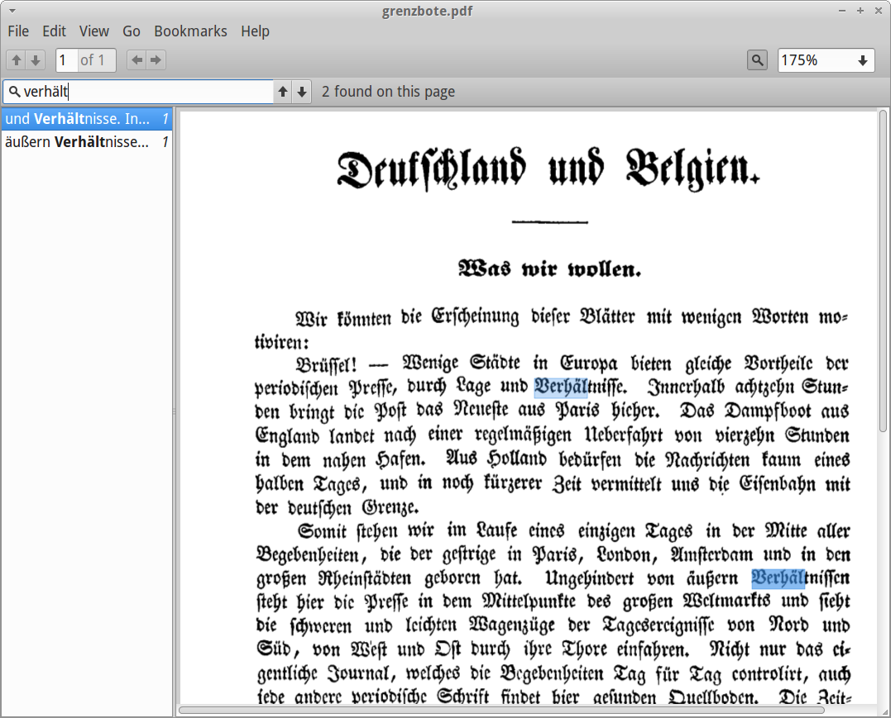
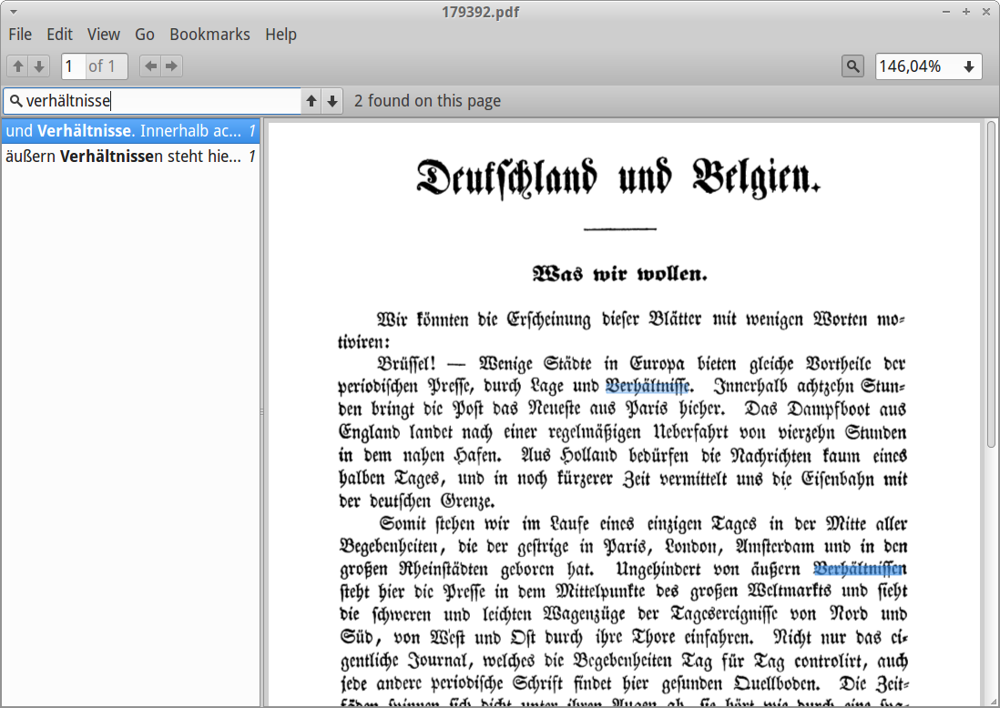

% Module 6  
  Other OCR engines: ABBYY, Tesseract
% Uwe Springmann
% 2015-09-14

# ABBYY

## ABBYY: Overview

* Russian company with leading OCR products:
    + FineReader (desktop product or CLI; not suitable for our purposes)
    + [FineReader Engine SDK][sdk] (Windows, Mac, Linux)
    + [Recognition Server][recogserv] (Windows)
    + [Cloud OCR SDK][cloudocr]
    + an excellent [comparison][comparison] of the different products at www.succeed-project.eu with hints helping you choose the right one

* state-of-the-art binarization and document analysis (zoning without semantics)
    
* was partner in IMPACT project

* can recognize [Fraktur (Gothic script)][histocr] and uses lexica with historical spellings
(not in FineReader desktop or CLI)

* you can use your own lexica (API)

* limited capability for glyph training

* many output formats (e.g. txt, pdf, xml)

* format supported by PoCoTo: ABBYY XML (not in FineReader desktop)

[histocr]: http://www.frakturschrift.com/de:start
[sdk]: http://www.abbyy.com/ocr-sdk/
[recogserv]: http://www.abbyy.de/recognition-server/
[cloudocr]: https://abbyy.technology/en:products:cloud-ocr:start
[comparison]: http://www.succeed-project.eu/wiki/index.php/Abbyy_FineReader_Engine_10

## ABBYY invocation

* for all SDK versions (Recognition Server, Engine, Cloud service) you will need to script your commands

* in the next practice module (m7), you will use the Cloud service with a provided script

* example: recognize a directory with page images of a historical German book with FineReader Engine SDK 11 for Linux
    + both text and xml output (with character confidences)
    + use historical lexicon
    + recognize Gothic typeface
    
    ```bash
        for i in *.tif; do 
            /opt/FRE11.1/Samples/CommandLineInterface/CLI \
            -if "$i" -tet UTF8 \
            -f Text -f XML --xmlWriteAsciiCharAttributes \
            -of ../"${i/.tif/.abbyy.txt}" -of ../"${i/.tif/.abbyy.xml}" \
            -rl OldGerman -rtt Gothic
        done
    ```

## ABBYY example: Die Grenzboten (1841)

* project done at Staats- und Universitätsbibliothek Bremen (Manfred Nölte)
* digitization support (zoning, OCR, correction) by BBAW, Berlin (Geyken, Bönig, Haaf, Jurish, Thomas, Wiegand, Würzner)

\ 

## ABBYY xml output

* box coordinates (left, top, right, bottom)

\


## Searchable pdf

output formats: searchable pdf (87kB), text and image (4.3kB)

\colA{6cm}

\

\colB{6cm}

\

\colEnd


## ABBYY assessment

\colA{5cm}

* undisputed leader in industrial space

* used in large-scale projects (newspapers, libraries)

* good preprocessing: binarization, document analysis

* use for 19th c. and later (even Fraktur)

\colB{5cm}

* single gyphs can be trained, but not complete typesets

* closed source, cannot be adapted/trained outside of company

* results on early printings currently unsatisfactory

\colEnd

# Tesseract

## Tesseract: History

* developed by [Ray Smith][theraysmith]:
    + 1984 PhD project sponsored by HP
    + 1988 developed for HP scanner products
    + 1994 project cancelled
    + 1995 UNLV evaluation (among 3 best products)

* 2005 open sourced by HP

* since 2006: taken on by Google
    + layout analysis, 39 languages
    + continuous development and improvement
    + used internally (but not exclusively) for Google books

* Ray Smith's [tutorial slides][tesstut] (2014) give fascinating background and insights

* some [documentation][docs]

[theraysmith]: http://research.google.com/pubs/author4479.html
[tesstut]: https://drive.google.com/folderview?id=0B7l10Bj_LprhQnpSRkpGMGV2eE0&usp
[docs]: https://github.com/tesseract-ocr/tesseract/wiki/Documentation

## Tesseract invocation

* from the command line:
    ```bash
        tesseract <imagefile> <outputbase> -l LANG
    ```
* example:
    ```bash
        tesseract 0001.tif 0001 -l deu-frak
    ```
    
    the output file will be `0001.txt`

* hOCR format:
    ```bash
        tesseract 0001.tif 0001 -l deu-frak html
    ```
* searchable pdf:
    ```bash
        tesseract 0001.tif 0001 -l deu-frak pdf
    ```
    
* you may also use a GUI (not all options are available)
    
## Tesseract hOCR output format

* either text (txt) or [hOCR][hOCR], an html-format with embedded segmentation info
* hOCR is a valid PoCoTo input format
* bounding box: x0y0 x1y1

```bash
<span class='ocrx_word' id='word_1_33' title='bbox 1584 1199 1997 1284; \
    x_wconf 87' lang='deu-frak' dir='ltr'>Verhältnisse.</span>
```
* hOCR has word tokens (separated by white space) as smallest unit
* Ben Kiessling ([Nidaba][nidaba] project), Kay Würzner have achieved character xml output (ABBYY-like)

[hOCR]: https://docs.google.com/document/d/1QQnIQtvdAC_8n92-LhwPcjtAUFwBlzE8EWnKAxlgVf0/preview?pli=1
[nidaba]: https://github.com/openphilology/nidaba

## Searchable pdf 

\


## Tesseract Training

* when to train:
    + enable recognition of a new "language"
    + rather, what is trained are glyph shapes:
        - new alphabet (Latin, Cyrillic, Greek etc.)
        - new typeface (Schriftart: Antiqua, Fraktur)
        - new font (Schriftsatz: special instance of a typeface, e.g. 12 pt Caslon italic) 
        - *optionally* add language data (wordlists) 
    + better recognition of special glyphs (e.g. recognize long s as ſ, not s)

* training data are in files of the form LANG.traineddata

* glyph shape training data and language support data (wordlists) are tied up in the same file

* language data can be exchanged without retraining (better and larger wordlists)

## Tesseract assessment

* in every respect not as good as ABBYY 

* but a fascinating tool for experiments and research:
    + open source
    + can be trained and adapted
    + then almost as good as ABBYY in recognition (not in preprocessing, language detection, output formats etc.)
    + many people provide training data (Nick White: ancient Greek!)
    
* can it be used for large scale projects?
    + recognition: yes
    + but OCR is a whole workflow of many steps (preprocessing!)
    + needs to be supplemented by other open source tools
    + makes it more complicated to build and monitor, but is possible
    
* provides an independent OCR result (output of both engines can be combined for error reduction)

# Evaluation

## Evaluation (101 pages of *Die Grenzboten*)

* use the UNLV/ISRI toolkit (see Module 0: Software)
* works on text pages (compared to ground truth):
    + `ocrevalutf8 accuracy gt-file OCR-file`
    + `ocrevalutf8 wordacc gt-file OCR-file`
    + combined report for many files: `accsum, wordaccsum`
* use `vote` for combining the output of several engines (>2)

* evaluation of first 101 pages of Grenzboten, mean values
    + no postcorrection, no training
    + voted has 1926 wrong characters, 984 wrong words

engine              character acc.      word acc.      lexicon
-------------- --------------------- --------------- -------------
ABBYY FRE11         98.86               96.48           OldGerman
Tesseract 3.03      97.78               93.11           German
OCRopus 0.7         98.17               91.60           none
voted               **99.28**           **97.59**

## Comparison of OCR engines

\colA{4cm}

ABBYY:

```bash
  268702   Characters
    3062   Errors
   98.86%  Accuracy

  Errors   Marked   Corr.-Gener.
     271        0   {e}-{c}
     264        0   {<\n>}-{}
     244        0   {<\n><\n>}-{}
      79        0   {}-{}
      55        0   {“}-{"}
      54        0   {en}-{m}
      54        0   {s}-{S}
      48        0   {m}-{n:}
      46        0   {R}-{N}
```

\colB{5cm}

Tesseract:

```bash
  268702   Characters
    5954   Errors
   97.78%  Accuracy

  Errors   Marked   Correct-Generated
     372        0   {}-{-}
     246        0   {ü}-{ii}
     228        0   {}-{ }
     215        0   {I}-{J}
     211        0   {v}-{V}
     208        0   {}-{<\n>}
     175        0   {u}-{n}
     140        0   {n}-{u}
     136        0   {c}-{e}
```

\colEnd

## Remaining errors after voting

\colA{5cm}

```bash
  268702   Characters
    1926   Errors
   99.28%  Accuracy

  Errors   Marked   Correct-Generated
     315        0   {<\n>}-{}
     154        0   {<\n><\n>}-{}
      54        0   {}-{}
      50        0   {“}-{"}
      43        0   { }-{}
      39        0   {I}-{J}
      34        0   {„}-{»}
      32        0   {}-{ }
      30        0   {}-{.}
      30        0   {“}-{,,}
      29        0   {u}-{n}
      27        0   {n}-{u}
```

\colB{5cm}

* among the most frequent errors, 637 are related to missing blank lines or different punctuation glyphs (99,52% acc. for text)

* the remaining errors have a long tail

* room for improvement:  
engines can be trained, better lexica, postcorrection

\colEnd

## More information


## Homework

* register for a free ABBYY developer account:
    + [register] with name of your app (make up a project name)
    + [enter a Cloud OCR SDK promo code][promocode]
    + promo code: (ask instructor)
    + 1.000 pages valid until 15 of January, 2016  
    (thanks to Michael Fuchs of ABBYY Deutschland)

* install Tesseract for your OS (see Module 0: Software)

[register]: http://cloud.ocrsdk.com/Account/Register
[promocode]: http://www.ABBYY-developers.eu/en:onlineocrsdk:promocodes

